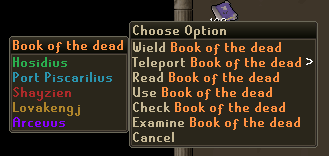
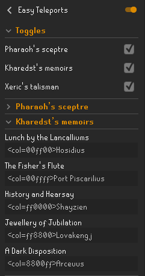
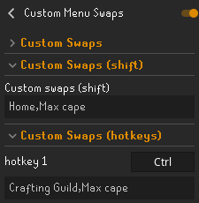

# Easy Teleports

Replaces difficult-to-remember teleport menu options
with custom values for items with two or more destinations, defaulting to more sensible values.

Within the config, you can enable and disable whole items,
or expand the collapsible sections to change the replacements.
Custom colours can be used by placing `<col=HEX>` before the value,
where `HEX` is a six-hexadecimal-digit (RGB) colour code.

Leaving a configuration field empty will revert to displaying the original menu entry value. 

### Example

### Menu Entry Swapper

#### Menu entry swapper doesn't work for custom menu names anymore!

If you notice that some of your teleport replacements or re-colors are no longer working with MES, you can use the plugin [Custom Menu Swaps](https://runelite.net/plugin-hub/show/hotkeyable-menu-swaps) to re-enable swaps with custom menu names, example:

### Supported Items

#### Enchanted jewellery
 Ring of dueling

 Slayer ring

 Necklace of passage

 Digsite pendant

 Games necklace

 Burning amulet

 Skills necklace

 Combat bracelet

 Ring of wealth

 Amulet of glory

#### Skill capes
 Construction cape

 Fishing cape

 Hunter cape

 Max cape

#### Achievement diary items
 Rada's blessing

 Karamja gloves

 Morytania legs

 Desert amulet

 Ardougne cloak

 Achievement diary cape

#### Quest-related items
 Kharedst's memoirs/Book of the dead

 Drakan's medallion

 Ring of shadows

 Enchanted lyre

 Camulet

 Eternal teleport crystal

#### Other items
 Pharaoh's sceptre

 Xeric's talisman

 Pendant of ates

 Ghommal's hilt

 Grand seed pod

 Ring of the elements

 Giantsoul amulet

 Ancient shard

 Disk of returning
